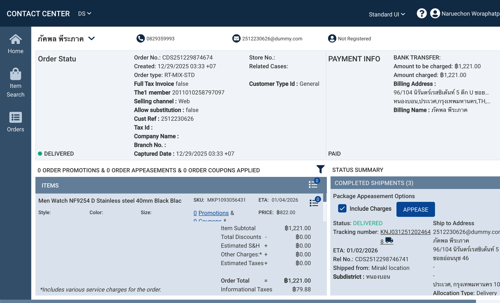

# Mock Data Spec: Order Status - Contact Center

**Source URL**: `https://crcpp.omni.manh.com/customerengagementfacade/app/orderstatus?orderId=CDS251229874674&selectedOrg=DS`
**ADW ID**: `pull001`
**Captured**: 2026-01-22
**Order ID**: `CDS251229874674`

---

## Customer Information

| Field | Example Value | Type | Notes |
|-------|---------------|------|-------|
| Customer Name | ภัคพล พีระภาค | string | Thai name |
| Phone | 0829359993 | string | |
| Email | 2512230626@dummy.com | string | |
| Registration Status | Not Registered | string | Values: Registered, Not Registered |

---

## Order Header

| Field | Example Value | Type | Notes |
|-------|---------------|------|-------|
| Order No. | CDS251229874674 | string | Primary order identifier |
| Created | 12/29/2025 03:33 +07 | datetime | GMT+7 timezone |
| Order Type | RT-MIX-STD | string | Order type code |
| Order Status | DELIVERED | string | Values: DELIVERED, IN_PROCESS, etc. |
| Store No. | (empty) | string | Optional |
| Related Cases | undefined | string | Link to case detail |
| Full Tax Invoice | false | boolean | |
| Customer Type Id | General | string | |
| The1 Member | 2011010258797097 | string | Loyalty member ID |
| Selling Channel | Web | string | Values: Web, Mobile, Store |
| Allow Substitution | false | boolean | |
| Cust Ref | 2512230626 | string | Customer reference |
| Tax Id | (empty) | string | For tax invoice |
| Company Name | (empty) | string | For B2B orders |
| Branch No. | (empty) | string | |
| Captured Date | 12/29/2025 03:33 +07 | datetime | |

---

## Payment Info

| Field | Example Value | Type | Notes |
|-------|---------------|------|-------|
| Payment Status | PAID | string | Values: PAID, PENDING, etc. |
| Payment Method | BANK TRANSFER | string | |
| Amount to be Charged | ฿1,221.00 | currency | |
| Amount Charged | ฿1,221.00 | currency | |
| Billing Address | 96/104 นิรันดร์เรสซิเด้นท์ 5 ตึก U ซอยอ่อนนุช 46,-,-, หนองบอน,ประเวศ,กรุงเทพมหานคร,TH,10250 | string | Full address |
| Billing Name | ภัคพล พีระภาค | string | |

---

## Order Promotions & Coupons Summary

| Field | Example Value | Type | Notes |
|-------|---------------|------|-------|
| Order Promotions Count | 0 | number | |
| Order Appeasements Count | 0 | number | |
| Order Coupons Applied Count | 0 | number | |

---

## Items (Line Items)

### Item Structure

| Field | Example Value | Type | Notes |
|-------|---------------|------|-------|
| Item Name | Men Watch NF9254 D Stainless steel 40mm Black Blac | string | Product title (truncated) |
| SKU | MKP1093056431 | string | Product SKU/Item code |
| ETA | 01/04/2026 | date | Estimated arrival |
| Style | (empty) | string | Product attribute |
| Color | (empty) | string | Product attribute |
| Size | (empty) | string | Product attribute |
| Price | ฿822.00 | currency | Unit price |
| Promotions Count | 0 | number | |
| Coupons Count | 0 | number | |
| Appeasements Count | 0 | number | |
| Notes Count | 0 | number | |
| Item Status | DELIVERED | string | |

### Item Additional Details

| Field | Example Value | Type | Notes |
|-------|---------------|------|-------|
| Shipping Method | Standard Pickup / Standard Delivery | string | |
| Route | (empty) | string | |
| Booking Slot From | (empty) | datetime | For scheduled delivery |
| Booking Slot To | (empty) | datetime | |
| SupplyTypeId | (empty) | string | |
| Bundle | false | boolean | |
| Bundle Ref Id | (empty) | string | |
| Packed Ordered Qty | 0 | number | |
| NumberOfPack | (empty) | number | |
| PackitemDescription | (empty) | string | |
| UOM | PCS | string | Unit of measure |
| Actual Weight | (empty) | number | |
| Promotion Id | (empty) | string | |
| Promotion Type | (empty) | string | |
| Secret Code | 860492 | string | Item verification code |
| Gift with Purchase | false | boolean | |
| Gift with Purchase Item | (empty) | string | |
| Gift Wrapped | (empty) | boolean | |

### Item Quantity Tracking

| Field | Example Value | Type | Notes |
|-------|---------------|------|-------|
| Ordered | 1 | number | |
| Allocated | 1 | number | |
| Released | 1 | number | |
| Picked Up / Fulfilled | 1 | number | Status varies |
| Delivered | 1 | number | |

### Item Pricing Breakdown

| Field | Example Value | Type | Notes |
|-------|---------------|------|-------|
| Subtotal | ฿822.00 | currency | |
| Discount | ฿0.00 | currency | |
| Charges | ฿0.00 | currency | |
| Taxes | ฿0.00 | currency | |
| Total | ฿822.00 | currency | |
| Informational Taxes | ฿53.78 | currency | VAT included |

---

## Order Summary

| Field | Example Value | Type | Notes |
|-------|---------------|------|-------|
| Item Subtotal | ฿1,221.00 | currency | |
| Total Discounts | ฿0.00 | currency | |
| Estimated S&H | ฿0.00 | currency | Shipping & Handling |
| Other Charges | ฿0.00 | currency | Service charges |
| Estimated Taxes | ฿0.00 | currency | |
| Order Total | ฿1,221.00 | currency | |
| Informational Taxes | ฿79.88 | currency | VAT info |

---

## Status Summary

### Shipment Categories

| Category | Count | Notes |
|----------|-------|-------|
| Completed Shipments | 3 | |
| In Process Shipments | 0 | |
| Planned Shipments | 0 | |
| Payments and Settlements | 2 | |

### Shipment Details Structure

| Field | Example Value | Type | Notes |
|-------|---------------|------|-------|
| Status | DELIVERED / PICKED UP | string | |
| Tracking Number | KNJ0312512024648 | string | Carrier tracking |
| ETA | 01/02/2026 | date | |
| Rel No. | CDS2512298746741 | string | Release number |
| Shipped From / Picked From | Mirakl location / SUKHUMVIT | string | Fulfillment source |
| Picked On | 01/01/2026 | date | For pickup orders |
| Subdistrict | หนองบอน | string | Thai subdistrict |
| CRC Tracking Link | https://th.kerryexpress.com/th/track/?track=KNJ0312512024648 | url | Kerry Express link |

### Ship To Address

| Field | Example Value | Type | Notes |
|-------|---------------|------|-------|
| Address Type | Ship to Address / Ship to Store | string | |
| Email | 2512230626@dummy.com | string | |
| Recipient Name | ภัคพล พีระภาค / ROBINSON SUKHUMVIT | string | |
| Address Line 1 | 96/104 นิรันดร์เรสซิเด้นท์ 5 ตึก U ซอยอ่อนนุช 46 | string | |
| Address Line 2 | (varies) | string | |
| Address Line 3 | (varies) | string | |
| City/District | ประเวศ, กรุงเทพมหานคร / WATTANA, Bangkok | string | |
| Postal Code | 10250 / 10110 | string | |
| Allocation Type | Delivery / Pickup / Merge | string | |
| Phone | 0829359993 / 026515333 | string | |

### Shipment Item Details

| Field | Example Value | Type | Notes |
|-------|---------------|------|-------|
| Item Name | Sandawatch men/women's wristwatch (ready to ship) | string | |
| SKU | MKP1875694 | string | |
| Shipped Qty / Picked Qty | 1 | number | |
| Ordered Qty | 1 | number | |
| UOM | PCS | string | |

---

## Payments and Settlements

### Invoice Structure

| Field | Example Value | Type | Notes |
|-------|---------------|------|-------|
| Invoice Type | Shipment | string | |
| Invoice No. | 17669991293468532966 | string | Long numeric ID |
| Invoice Status | Closed | string | |
| Invoice Date | 12/29/2025 | date | |
| Invoice Amount | ฿822.00 | currency | |

### Invoice Line Item

| Field | Example Value | Type | Notes |
|-------|---------------|------|-------|
| Item Name | Men Watch NF9254 D Stainless steel 40mm Black Blac | string | |
| SKU | MKP1093056431 | string | |
| Qty | 1 | number | |
| Unit Price | ฿822.00 | currency | |
| Subtotal | ฿822.00 | currency | |
| Discount | ฿0.00 | currency | |
| Charges | ฿0.00 | currency | |
| Taxes | ฿0.00 | currency | |
| Total | ฿822.00 | currency | |
| Informational Taxes | ฿53.78 | currency | |

### Payment Transaction

| Field | Example Value | Type | Notes |
|-------|---------------|------|-------|
| Payment Method | Bank Transfer | string | |
| Transaction Date | 12/29/2025 | date | |
| Amount Charged | ฿822.00 | currency | |

### Invoice Summary

| Field | Example Value | Type | Notes |
|-------|---------------|------|-------|
| Item Subtotal | ฿822.00 | currency | |
| Total Discounts | ฿0.00 | currency | |
| Total Charges | ฿0.00 | currency | |
| Total Taxes | ฿0.00 | currency | |
| Shipment Total | ฿822.00 | currency | |
| Informational Taxes | ฿53.78 | currency | |

---

## Package Appeasement Options

| Field | Example Value | Type | Notes |
|-------|---------------|------|-------|
| Include Charges | true | boolean | Checkbox option |
| Appease Action | (button) | action | Triggers appeasement |

---

## UI Elements & Actions

| Element | Location | Notes |
|---------|----------|-------|
| More Info Button | Per item | Expands item details |
| Notes Icon | Per item/order | Shows note count badge |
| Filter Icon | Items section | Filter items |
| Tracking Link | Shipment section | Opens carrier tracking |
| Appease Button | Shipment section | Create appeasement |

---

## Sample Data - Items Array

```json
{
  "items": [
    {
      "name": "Men Watch NF9254 D Stainless steel 40mm Black Blac",
      "sku": "MKP1093056431",
      "eta": "01/04/2026",
      "style": null,
      "color": null,
      "size": null,
      "price": 822.00,
      "currency": "THB",
      "status": "DELIVERED",
      "shippingMethod": "Standard Pickup",
      "uom": "PCS",
      "secretCode": "860492",
      "giftWithPurchase": false,
      "bundle": false,
      "quantities": {
        "ordered": 1,
        "allocated": 1,
        "released": 1,
        "pickedUp": 1,
        "delivered": 1
      },
      "pricing": {
        "subtotal": 822.00,
        "discount": 0.00,
        "charges": 0.00,
        "taxes": 0.00,
        "total": 822.00,
        "informationalTaxes": 53.78
      }
    },
    {
      "name": "Sandawatch men/women's wristwatch (ready to ship)",
      "sku": "MKP1875694",
      "eta": "01/02/2026",
      "style": null,
      "color": null,
      "size": null,
      "price": 399.00,
      "currency": "THB",
      "status": "DELIVERED",
      "shippingMethod": "Standard Delivery",
      "uom": "PCS",
      "secretCode": null,
      "giftWithPurchase": false,
      "bundle": false,
      "quantities": {
        "ordered": 1,
        "allocated": 1,
        "released": 1,
        "fulfilled": 1,
        "delivered": 1
      },
      "pricing": {
        "subtotal": 399.00,
        "discount": 0.00,
        "charges": 0.00,
        "taxes": 0.00,
        "total": 399.00,
        "informationalTaxes": 26.10
      }
    }
  ]
}
```

---

## Screenshot Reference


